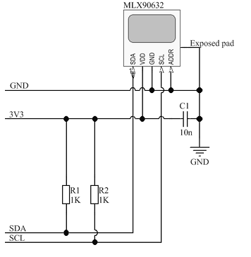
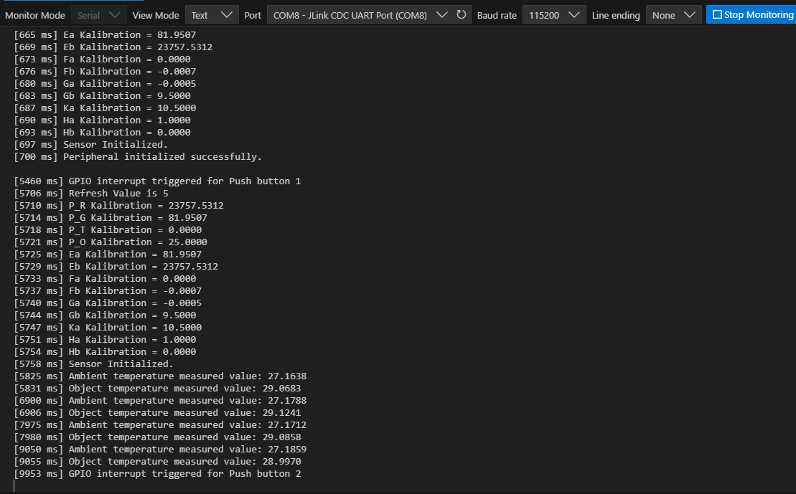

# NORAB106 MLX90632 Project

# 📟 EmbeddedProject
Embedded Application to demonstrate melexis MLX90632 FIR sensor integration with uBlox chip NORAB106.

## 🚀 Features
- ✅ Push Button 1 on evaluation board EVK-NORA-B1 to start the measure
- ✅ Read ambient tempearature and object temperature using algorithm and i2c protocol
- ✅ Push Button 2 on evaluation board EVK-NORA-B1 to stop the measure

## 🚀 Code Features
- ✅ Abstration layer to manage gpios
- ✅ abstraction laser to manage i2c protocol
- ✅ code and optimization adaptation to zephyr libraries starting from open source melexis library

## 🔧 Requirements
- Microcontroller: UBLOX NORAB106
- Toolchain: VsCode + Extensions nRF Connect
- Hardware:
  - Sensor MLX90632
  - 2 Resistor 1KΩ
  - Main Board: EVK-NORAB106
- Programming Interface: USB-UART

## 🛠️ Technologies
- Languages: C
- Framework: ncs 2.2.0
- Libraries: Zephyr

## 🏗️ Hardware Setup
EVK-NORAB106 communicate with the sensor via SPI.
Sensor MLX90632 can be soldered or surface mounted where the following pin matching shall be reproduced:
| EVK NORAB106 header pin | MLX90632 pin |
|:-----------:|:------------:|
| 3.3V      | #2 |
| GND    | #3 |
| P1.02 (SDA)     | #1 |
| P1.03 (SCL)     | #4 |

I2C requires pull-up resistors on its signal lines as shown in this picture:


MLX90632 soldered is available with evaluation board EVB90632.

## 🏗️ Software Toolchain Setup
- Install VS-Code
- Install Extensions: nRF Connect for VS Code and nRF Connect for VS Code Extension Pack
- From nRF Connect, install SDK toolchain v3.0.2 (next version shouldn't be a problem)
- From nRF Connect, install n.c.s 2.2.0 (it's a big constraint to use EVK-NORAB106).

## 🏗️ Software Application Setup
- Clone github project (see suggestion below) then, there're some preliminary actions to recognize the board.
- Download the entire package https://github.com/u-blox/u-blox-sho-OpenCPU/tree/master 
- From downloaded package.
   1. navigate to the folder "zephyr/boards/arm/archive/ubx_evknorab10_nrf5340_ncs220"
   2. copy the folder and past in your ncs path  "C:\ncs\v2.2.0\zephyr\boards\arm\"
   3. At this point, you 'll able to create new project using EVK board NORAB106
- Copy and paste the melexis file bindings (sensor_fb/melexis,mlx90632.yaml) in the folder C:\ncs\v2.2.0\zephyr\dts\bindings\sensor"
- import the project in VS-Code.
- Select nRF Connect Extension in the activity bar and in this section you can build the project and flash software in your evk.

## 📦 Github Setup
Clone the repository:
```bash
git clone https://github.com/MpDev89/NORAB106_mlx90632.git
cd project-name
```

## 🗒️ Test and Results
Application Testing require the following steps:
1. Flash application
2. Open Serial Monitor, Peripheral and sensor will be initialized
3. Application in standby until button 1 is pushed
4. Push button 1 and measuring is started
5. Ambient temperature  and Object temperature is transmitted each second
5. Push Button 2 to stop the measure 
Data is monitored using Serial Monitor:


## 🗒️ Licensing
This project includes original code from Melexis N.V. under the Apache 2.0 License.
Additional functionality was added by Marconatale Parise in June 2025, including:
- Data structure to extrapolate sensor data. 
- Function to improve the code readability and for debug

Custom code for variables and constant are marked with:
    /* === Added by Marconatale Parise for.. [description of the new code] === */
Custom code for function are marked specifying the author (@author Marconatale Parise) in the description.

## 🌐 Contatti
[](mailto:mp@tech-in-mind.it)  
[](https://www.linkedin.com/in/marconatale-parise-48a07b94)  
[](https://github.com/MpDev89)